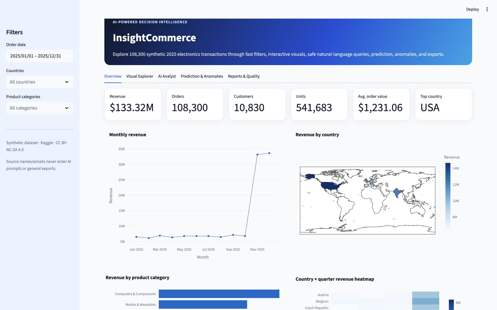
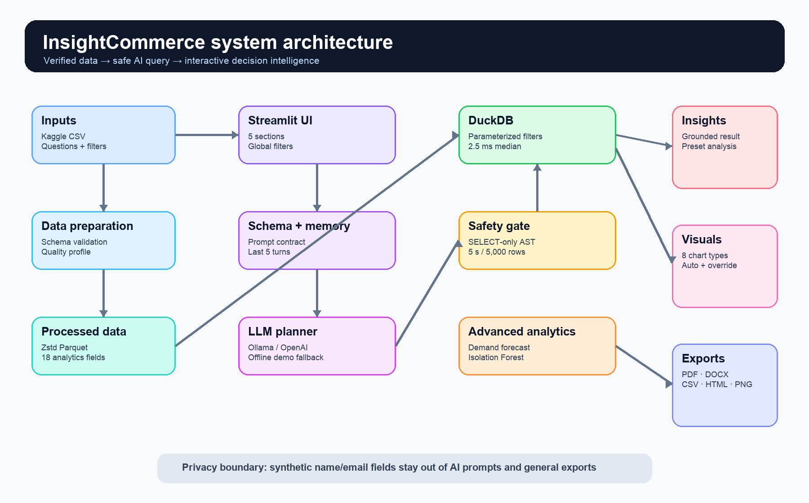

# InsightCommerce

**An AI-Powered E-Commerce Analytics and Decision Intelligence Platform**

InsightCommerce turns 108,300 synthetic 2025 electronics transactions into a
fast, interactive decision-support application. It combines a verified data
backend, schema-aware natural-language queries, guarded text-to-SQL execution,
eight visualization types, daily demand prediction, anomaly detection, and
downloadable PDF/DOCX/chart/data outputs.



## Verified outcome

| Acceptance check | Current evidence |
|---|---:|
| Dataset | 108,300 rows × 10 exact source columns |
| Missing cells / duplicate order IDs | 0 / 0 |
| Filtered aggregation median | **2.52 ms** (required: <500 ms) |
| Automated tests | **21 passed** |
| Ten-question benchmark | **10/10 (100%)** |
| Dashboard visualization types | **8 prepared + manual builder** |
| Conversational memory | **Last 5 successful turns** |
| Generated-query retry limit | **Exactly 1 retry** |
| Predictive evaluation | MAE 12.4 orders, R² 0.995 on 53 held-out days |
| Global anomaly flags | 1,006 investigative signals |

## Capstone requirement coverage

| Task | Implementation |
|---|---|
| **A — Data backend** | Immutable Kaggle CSV, exact schema validation, deterministic cleaning, Parquet conversion, DuckDB, schema inspection, quality JSON, parameterized filters, and an automated sub-500 ms gate. |
| **B — LLM integration** | Schema-aware prompt contract, Ollama and optional OpenAI adapters, strict JSON query plan, SQL AST safety validation, five-second timeout, 5,000-row limit, one corrective retry, five-turn memory, grounded narrative, and six preset insights. |
| **C — Dashboard & visualization** | Five-section Streamlit interface, global date/country/category filters, KPIs, line, map, bar, heatmap, treemap, scatter, box, histogram, AI chart recommendation, manual override, and PDF/DOCX/CSV/HTML/PNG paths. |
| **D — Advanced analytics** | Random Forest daily order-demand model plus Isolation Forest transaction anomaly detection with public fields and human-readable reason codes. |

## Dataset and schema decision

The official source is [Synthetic E-Commerce Electronic Sales 2025 Dataset on
Kaggle](https://www.kaggle.com/datasets/wojciechkiebowicz/e-commerce-electronic-sales-2025-dataset),
published by Wojciech Kiełbowicz under CC BY-NC-SA 4.0.

The original fields are:

```text
order_id, date, customer_id, customer_name, customer_email,
country, product, price, quantity, order_value
```

The dataset does **not** contain profit, discount, category, shipping, or
cancellation fields. InsightCommerce therefore does not invent these measures.
It adds only documented calendar fields and a reproducible electronics product
taxonomy. Prediction focuses on daily demand; anomaly detection focuses on
unusual transaction combinations. See [dataset verification](docs/dataset_verification.md).

## Architecture



The generated SQL boundary is intentionally narrow:

- one parsed `SELECT`/CTE statement;
- only the in-memory `orders` table;
- no mutation, DDL, commands, external files, URLs, extensions, or environment access;
- no `customer_name`, `customer_email`, or unrestricted `SELECT *`;
- maximum 5,000 returned rows and a five-second execution deadline;
- one error-informed retry, then a clear failure.

The optional OpenAI adapter uses the Responses API with a strict JSON Schema
output format, following the [official Structured Outputs documentation](https://developers.openai.com/api/docs/guides/structured-outputs).
The app also supports local Ollama and a clearly labeled offline demonstration
planner for no-credential evaluation.

## Run locally on macOS

Python 3.12 is recommended.

For this prepared Mac, double-click `start_app.command` or run:

```bash
./start_app.command
```

See the [presentation and feature-testing guide](docs/PRESENTATION_DEMO_GUIDE.md)
for the exact rehearsal sequence and expected results.

For a new environment, use the full setup below.

```bash
cd insightcommerce-ai-analytics
python3.12 -m venv .venv
source .venv/bin/activate
python -m pip install --upgrade pip
pip install -r requirements-dev.txt
python scripts/prepare_data.py
streamlit run app.py
```

Open `http://localhost:8501` if the browser does not open automatically.

### Live local LLM with Ollama

```bash
ollama pull llama3.1:8b
ollama serve
```

Keep the default values in `.env.example` as environment variables, then select
**Ollama (local LLM)** in the AI Analyst tab.

### Optional hosted OpenAI provider

Set secrets outside Git, then select **OpenAI (hosted, optional)**:

```bash
export OPENAI_API_KEY="your-key"
export OPENAI_MODEL="gpt-5-mini"
```

Never commit a real key. The application works without one using Offline demo.

## Test and benchmark

```bash
pytest
ruff check app.py src scripts tests
python scripts/benchmark_performance.py
python scripts/run_question_benchmark.py
```

Evidence is stored in `artifacts/benchmarks/`:

- `performance.json` — filtered aggregation latency;
- `question_benchmark.json` — machine-readable ten-question results;
- `question_benchmark.md` — report-ready accuracy table.

## Example questions

- What is the total revenue?
- Show the monthly revenue trend for 2025.
- Which countries generated the most revenue?
- Which country has the highest average order value?
- Show the top 10 products by revenue.
- Compare revenue across product categories.
- Compare every quarter and highlight Q4 performance.
- Show its monthly trend. *(uses recent conversation context with a live LLM)*

## Project structure

```text
insightcommerce-ai-analytics/
├── app.py                         Streamlit application
├── data/
│   ├── raw/                       Unchanged Kaggle ZIP and CSV
│   └── processed/                 Generated Parquet/schema/quality artifacts
├── src/insightcommerce/           Data, AI, safety, charts, ML, anomaly, exports
├── scripts/                       Preparation, benchmarks, assets, final report
├── tests/                         Unit, security, export, ML, and performance tests
├── artifacts/benchmarks/          Reproducible benchmark evidence
├── docs/                          Architecture, security, model, deployment notes
├── output/pdf/                    Final capstone PDF report
├── Dockerfile                     Container deployment
├── requirements.txt               Pinned runtime dependencies
└── requirements-dev.txt           Pinned test and quality tools
```

## Prediction and anomaly limitations

The dataset is synthetic, contains one year, and has an intentionally strong Q4
pattern. The demand model is an academic demonstration, not a causal production
forecast. Indicative revenue is predicted orders multiplied by historical median
order value. Anomaly flags indicate unusual combinations, not confirmed fraud or
error. Full limitations are in [the model card](docs/MODEL_CARD.md).

## Deployment

The repository is prepared for Streamlit Community Cloud, a conventional process
host (`Procfile`), and Docker. Offline demo works on hosted platforms without an
LLM secret. Local Ollama is not directly reachable from Streamlit Community Cloud;
use a protected hosted provider there if live LLM calls are required. Follow the
[deployment checklist](docs/DEPLOYMENT.md).

## Licensing

Application code: MIT. Dataset: CC BY-NC-SA 4.0 under the source publisher's
terms. The dataset license remains separate from the software license.
